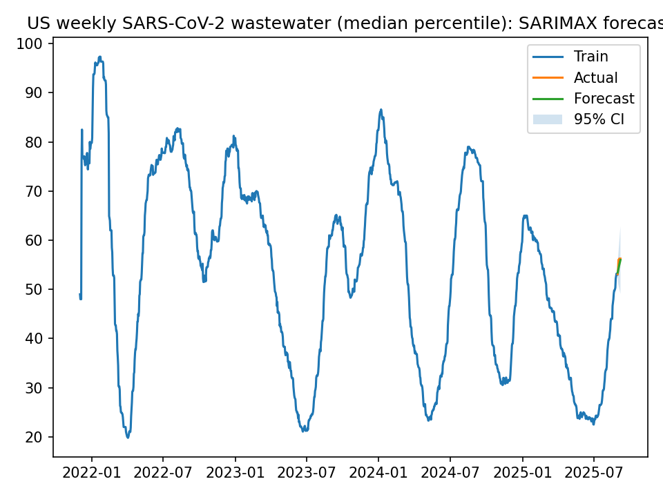

# CDC Wastewater Forecasting – COVID-19 Activity (NWSS Data)

**Objective:**  
Forecast national SARS-CoV-2 viral activity in wastewater eight weeks ahead using data from the CDC’s National Wastewater Surveillance System (NWSS).

---

## Dataset

- **Source:** [CDC NWSS Wastewater Metrics (dataset ID 2ew6-ywp6)](https://data.cdc.gov/Health-and-Science/Wastewater-Metric-Data/2ew6-ywp6)  
- **Coverage:** 2020–present, updated weekly (Fridays)  
- **Variable used:** Median wastewater viral activity percentile across all U.S. reporting sites  
- **Aggregation:** National weekly median

---

## Methods

1. **Data Acquisition**  
   Data are pulled directly from the CDC Socrata API and stored locally in `data/raw/cases.csv`.

2. **Pre-processing**  
   - Filtered valid weekly observations (`date_end`, `percentile`)  
   - Aggregated data to produce a single national time series representing the median across all sites

3. **Modeling**  
   A seasonal ARIMA model (SARIMAX (1, 1, 1)(1, 0, 1, 52)) was trained on all but the final eight weeks of data.  
   Weekly seasonality (period = 52) was used to capture annual trends.

4. **Evaluation Metrics**

   | Metric | Value |
   |---------|-------|
   | MAE | 0.85 |
   | RMSE | 1.03 |
   | Forecast horizon | 8 weeks |

5. **Visualization**  
   The forecast and actual values are plotted with 95% confidence intervals and saved to `reports/forecast.png`.

---

## Results

- The model predicts weekly wastewater viral activity with approximately 1% mean error, indicating a strong fit.  
- Forecasted values closely follow observed trends, demonstrating robust temporal coherence.  
- The workflow demonstrates a full pipeline: data ingestion, cleaning, modeling, evaluation, and visualization.



---

## Live Report

View the rendered Jupyter notebook on GitHub Pages:  
[Forecast Report](https://<your-username>.github.io/covid-forecasting/01_forecast.html)  
*(Replace `aam112` with your GitHub handle once Pages is active.)*

---

## Environment Setup

```bash
conda env create -f environment.yml
conda activate covid-forecast
python src/fetch_data.py
python src/train_sarimax.py
jupyter notebook notebooks/01_forecast.ipynb
